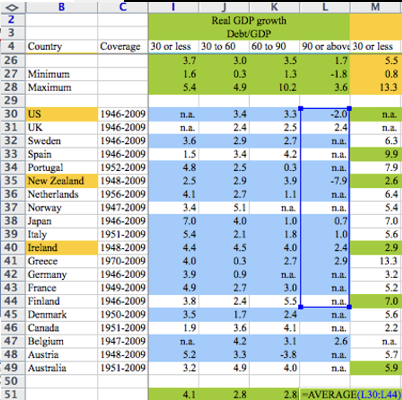

<style> /* this works for export */ @import url("/Users/skojaku-admin/Documents/projects/teaching/adv-net-sci/adv-net-sci-course/slides/m03/marp-style.css" ); /* this works in preview */ @import url( "marp-style.css" );
</style>

<style>
</style>

# Quiz

---


<div style="font-size:20pt;margin-top:-5%">

1. You will start up a social networking service and want to attract popular people to promote your service. Which of the following approaches is more likely to attract popular people as users? Explain why from the perspective of the friendship paradox.
   - **Waiting list**: Anyone can sign up for a waiting list and join the service on a first-come-first-served basis.
   - **Invitation**: Users can invite a given number of new users.

2. Create the Compressed Sparse Row Format of the undirected and unweighted network shown below with three arrays `indptr`, `indices` and `data`.


<center>


</center>

</div>

---


# <center  style="margin-top:7%"> Friendship paradox </center>

#### <center style="margin-top:7%">Your friends have more friends than you do</center>
<center style="margin-top:0%">on average</center>

---

### Let's test the Friendship paradox

Average \# of friends
$$
(1 + 3 + 2 + 2)/4 = 2
$$
Average \# of friends *a friend has*
$$
(\underbrace{1}_{\text{Abby}} + \underbrace{3 +3 + 3}_{\text{Becca}} +  \underbrace{2 + 2}_{\text{Chloe}} + \underbrace{2 +2}_{\text{Deb}}) / 8 = 2.25
$$


---

## The friendship paradox is a ***mathematical*** fact


It is always true unless everyone has an equal number of friends.

**Why?**:
Popular individuals appear frequently in someone's friend list.

---


### ... and beyond an interesting piece of trivia

- Why is word-of-mouth an effective marketing strategy?

- Why can an infectious disease spread so quickly  🦠?

- Why is the snow-ball sampling biased?

---

<div style="font-size:27px">

You will start up a social networking service and want to attract popular people to promote your service. Which of the following approaches is more likely to attract popular people as users? Explain why from the perspective of the friendship paradox.
   - **Waiting list**: Anyone can sign up for a waiting list and join the service on a first-come-first-served basis.
   - **Invitation**: Users can invite a given number of new users.

</div>


---

<div style="font-size:27px">

You will start up a social networking service and want to attract popular people to promote your service. Which of the following approaches is more likely to attract popular people as users? Explain why from the perspective of the friendship paradox.
   - **Waiting list**: Anyone can sign up for a waiting list and join the service on a first-come-first-served basis.
   - **Invitation**: Users can invite a given number of new users.

**Answer**: The invitation-based approach is considered more effective as it takes advantage of the friendship paradox, which means that popular individuals are more likely to receive invitations through social contacts.

</div>

---

<center>Another trivia </center>

## **<center>Vaccinating a friend is a more effective preventive measure than vaccinating an individual.</center>**

# <center style="margin-top:80px"> Why 🤔?</center>


---

<div style="font-size:22pt;margin-top:-5%">

First of all, let's create the adjacency list:

<center>


</center>

```
{
  1: [2,5],
  2: [1,3,5],
  3: [2,4],
  4: [3,5,6],
  5: [1,2,4],
  6: [4],
}
```

Then, create the CSR representation:
```
indices = [2,5,1,3,5,2,4,3,5,6,1,2,4,4]
indptr = [0,2,5,7,10,13,14]
data = [1,1,1,1,1,1,1,1,1,1,1,1,1,1]
```

</div>

---

- **Pros🙂**
  - Space efficient
    - Only takes $2m$ values, where $m$ is the number of non-zero entries.
  - Time efficient
    - Matrix product scales *linearly* by $m$ for sparse matrix 🚀
    - Dense matrix scales with $n^2$ ($n$ = \# of nodes).
  - Efficient format for parallel computing

What are the *cons 🤔?*

---

- **Cons 🥲**
  - Changes to the network structure are expensive.
    - E.g., Adding/deleting an edge requires to compile from scratch.
  - CSR is slow in column slicing, e.g.,
    ```
    A[1, :] # Row slicing is fast
    A[:, 1] # Column slicing is slow
    ```
  - CSC is slow in *row* slicing

---

<div style="font-size:28px">

- **Edge table**
  - 🙂 Portable & Space efficient. 🥲 Inconvenient for computing
- **Adjacency matrix**
  - 🙂 Convenient for computing and math. 🥲 Space inefficient.
- **Adjacency list**
  - 🙂 Space efficient. Efficient access to *local* structure. 🥲 Not convenient for computing *global* stats.
- **Compressed Sparse Row/Columns**
  - 🙂 Space and Time efficient. 🥲 Not flexible to changes in the structure.
- **Others**. COOrdinate, List of List, etc.

</div>

---


### **Advanced Topics in Network Science**

SSIE 641

Module 3

Sadamori Kojaku

https://github.com/skojaku/adv-net-sci-course

---

### For EngiNet™ students


WARNING

All rights reserved.  No part of the course materials used in the instruction of this course may be reproduced in any form or by any electronic or mechanical means, including the use of information storage and retrieval systems, without written approval from the copyright owner.

©2023  Binghamton University state University of New York

---

# EngiNet Office Staff

- Janice Kinzer
  - Email:  enginet@binghamton.edu
  - Phone:  1-800-478-0718 or 607-777-4965
- Media Production Operator:
  - Sneha Rawat
- Instructor:
  - Sadamori Kojaku
  - skojaku@iu.edu

---

### <center >Network of the Week</center>

- Find an interesting network-related work
- Write a critique about it, shared it, and discuss it.
- Share it on Brightspace, and optionally Slack (`#interesting-nets` channel)
- https://brightspace.binghamton.edu/d2l/le/251332/discussions/List

---

### <center> Github codespaces </center>


<center>

https://github.com/skojaku/adv-net-sci-course


</center>

---

# <center style="margin-top:30%">Data normalization</center>

---

# <center>Data normalization</center>

<div class ="container">
<div class="col" style="margin-left:10%;flex:1">

<center>

#### Unnormalized

<div  style= "font-size:18px;">

| Person 1 | Person 2 |
| -------- | -------- |
| John     | Yu       |
| Carla    | Yu       |
| Carla    | Celine   |
| Celine   | Yu       |
| Celine   | Robert   |
| Robert   | Chang    |
| Robert   | Rob      |
| Robert   | Yu       |
| Chang    | Hana     |
| Rob      | Wilson   |
| Rob      | Diana    |
| Wilson   | Yu       |
| Simon    | Yu       |

</div>

</center>
</div>

<div class="col" style="flex:0.3;margin-right:5%">

# <center style="margin-top:250%">➡️</center>

</div>

<center class="col">

#### **Node table**

<div style= "font-size:20px;">

| node_id | Name   |
| ------- | ------ |
| 0       | John   |
| 1       | Carla  |
| 2       | Celine |
| 3       | Robert |
| 4       | Chang  |
| 5       | Hana   |
| 6       | Rob    |
| 7       | Diana  |
| 8       | Wilson |
| 9       | Simon  |
| 10      | Yu     |

</div>

</center>

<center class="col" >

#### **Edge table**

<div style= "font-size:18px;">

| src | trg |
| --- | --- |
| 0   | 10  |
| 1   | 10  |
| 1   | 2   |
| 2   | 10  |
| 2   | 3   |
| 3   | 4   |
| 3   | 5   |
| 3   | 6   |
| 4   | 7   |
| 6   | 8   |
| 6   | 9   |
| 8   | 10  |
| 9   | 10  |

</div>

</center>
</div>

---


# <center class="vindent">Data integrity</center>
<center>
...is about how well data are organized and preserved throughout its life cycle, ensuring accuracy, completeness, and consistency.
</center>

---

# <center class="vindent">Spreadsheets (Excel) considered harmful</center>

<center>

Horror stories 🙈 https://eusprig.org/research-info/horror-stories/

</center>


---

[The Reinhart-Rogoff error – or how not to Excel at economics](https://theconversation.com/the-reinhart-rogoff-error-or-how-not-to-excel-at-economics-13646)




---


<center>

[When Spreadsheets Attack! - YouTube](https://www.youtube.com/watch?v=yb2zkxHDfUE&t=1s)

<iframe width="800px" height="450px" src="https://www.youtube.com/embed/yb2zkxHDfUE?si=uArRCbz8nB4bGBaN" title="YouTube video player" frameborder="0" allow="accelerometer; autoplay; clipboard-write; encrypted-media; gyroscope; picture-in-picture; web-share" allowfullscreen></iframe>

</center>

---

[An alarming number of scientific papers contain Excel errors - The Washington Post](https://www.washingtonpost.com/news/wonk/wp/2016/08/26/an-alarming-number-of-scientific-papers-contain-excel-errors/?postshare=4161472211255740)


---

#### <center style="font-size:70px;margin-top:15%">Data analysis 💔 Excel </center>

# <center style="font-size:100px">😭😭😭 </center>

---

<div class="container">

<div class="col" style="flex:1">

<center class="vindent" style="margin-top:50%"> Zen of Python</center>

### <center> *"Explicit is better than implicit"* </center>


</div>
<div class="col" style="flex:0.8">

<div style="font-size:30px;margin-top:50%">


```python
import this
```

```
Beautiful is better than ugly.
Explicit is better than implicit.
Simple is better than complex.
Complex is better than complicated.
Flat is better than nested.
Sparse is better than dense.
Readability counts.
Special cases aren't special enough to break the rules.
Although practicality beats purity.
Errors should never pass silently.
Unless explicitly silenced.
In the face of ambiguity, refuse the temptation to guess.
There should be one-- and preferably only one --obvious way to do it.
Although that way may not be obvious at first unless you're Dutch.
Now is better than never.
Although never is often better than *right* now.
If the implementation is hard to explain, it's a bad idea.
If the implementation is easy to explain, it may be a good idea.
Namespaces are one honking great idea -- let's do more of those!
```

</div>
</div>
</div>

---
#### What is the potential problem of not being explicit?

Example:
```python
import pandas as pd
data_table = pd.read_csv(filename)
```

Data that may break this code?

- Zip code
- ...anything else?

---

#### What is the potential problem of not being explicit?

Example:
```python
import pandas as pd
data_table = pd.read_csv(filename)
```


---

Always specify the data types:

```
import pandas as pd

contact_data_table = pd.read_csv(
    filename,
    dtype={
        "user_a": str,
        "user_b": str,
        "rssi": int,
        "#timestamp": int,
    },
)

```

---

# <center> Data Provenance </center>

- Documented trail of data from its generation to the current.
- Where the data was taken from, how it was processed and transformed into the current data.

---

## <center class="vindent"> *Documentation <br> is <br> Automation* </center>

<div style="font-size:25px">

[Documentation Is Automation | June 2018 | Communications of the ACM](https://cacm.acm.org/magazines/2018/6/228040-documentation-is-automation/abstract)

</div>


---

# <center class="vindent"> One-mode projection </center>

<center style="margin-top:55px"> Probably the most commonly used network construction method </center>

---

### <center > Two types of measurements of edges </center>

- **Direct**:
  - e.g., ask people for their friends to identify friendship ties.
- **Indirect (inferential)**:
  - e.g., consider two people having a friendship tie if they hang out together frequently.
  - *Most networks are this type*.

Let's focus on the indirect measurement of edges through an example of Davis Sourthern Club Women

---

<div class="container">
<div class="col" style="flex:2;margin-right:40px">

- A social anthropological study by Davis et al. published in 1941.
- Documenting how race shaped nearly every aspect of life in US through a study of a rural Mississippi community


</div>
<div class="col" style="flex:1">


</div>
</div>


---

<div style="font-size:32px">

- Observed attendance at 14 social events by 18 Southern women.
- <p class="red">No direct measurements of social ties between the women</p>
- Can make a reasonable inference about social ties 🤔?

</div>


---

### Represent the data as a *bipartite network*

<div class="container">
<div class="col" style="flex:0.2">

<center style="margin-top:40%">


</center>

</div>
<div class="col" style="flex:.2">

<center style="margin-top:180px;font-size:80px;margin-right:30px;margin-left:30px;">
▶️
</center>

</div>
<div class="col" style="flex:1.5">

<center style="margin-top:15%">


</center>


</div>
</div>

<center>

*Bipartite network = a network consisting of two different types of nodes.*
</center>

---


### One mode projection

<div class="container">

<div class="col" style="flex:1">

<div style="margin-top:120px">


Place an edge between two women (blue) if they participated in the same event (orange).

</div>

</div>
<div class="col" style="flex:1;margin-left:90px">


</div>
</div>

---

### One bipartite network, two projections

<center style="margin-top:20%">


</center>

---

<center style = "margin-top:50%">

The Southern women network constructed by a one-mode projection.

[Davis Club — NetworkX 3.1 documentation](https://networkx.org/documentation/stable/auto_examples/algorithms/plot_davis_club.html)

</center>


---

<center>

# Most networks are generated by one mode projection!

...and thus the connections are inferential.

</center>

---

Created by a one-mode projection of flavor-recipe bipartite network.


---

Created by a one-mode projection of actor-movie bipartite network.


---

<center style="margin-top:25%">

# Any other networks generated by one-mode projection?

</center>

---

<center style="margin-top:25%">

# Any other networks generated by one-mode projection?

Affiliation networks, coauthorship networks, human disease networks, word networks, co-purchased product networks, ...

</center>


---

### Discussion

Translate the one-mode projection into a matrix operation.
  - Imagine a bipartite network consisting of $N_X$ nodes of mode $X$ (e.g., women) and $N_Y$ nodes of mode $Y$ (e.g., events).
  - Denoted by $B$ the $N_X\times N_Y$ adjacency matrix of the bipartite network, where $B_{xy}=1$ if nodes $x$ in mode $X$ and $y$ in mode $Y$ are connected. Otherwise, $B_{xy}=0$
  - Express the adjacency matrix $A_X$ of the network projected on $X$ using $B$. Self-loops are allowed.
  - Express $A_Y$ of the network projected on $Y$ by using $B$.

<div class="container">
<div class="col" style="flex:1;font-size:22px">

Hint: Consider a small bipartite network. Write $B$ and $A$. Think about how to compute $A_{ij}$ with $B_{xy}$. Then translate it into a matrix operation.

</div>
<div class="col" style="flex:1">


</div>
</div>

---

---

$$
(A_{X})_{ij} = \sum_{y} B_{iy} B_{jy}
$$

$$
(A_{Y})_{ij} = \sum_{x} B_{xi} B_{xj}
$$

<center> or alternatively, </center>

$$
A_X = B \times B^\top
$$

$$
A_Y = B^\top \times B$$

---

<center class="vindent">

# How networks can fool us

or how we misinterpret them.

</center>

---

<center>

# Is obesity contagious?


[The Spread of Obesity in a Large Social Network over 32 Years | NEJM](https://www.nejm.org/doi/full/10.1056/nejmsa066082)


</center>

---

##### Smoking habits, happiness, and loneliness are also contagious!

- [Dynamic spread of happiness in a large social network: longitudinal analysis over 20 years in the Framingham Heart Study | The BMJ](https://www.bmj.com/content/337/bmj.a2338)
- [The Collective Dynamics of Smoking in a Large Social Network | NEJM](https://www.nejm.org/doi/10.1056/NEJMsa0706154?url_ver=Z39.88-2003&rfr_id=ori:rid:crossref.org&rfr_dat=cr_pub%20%200www.ncbi.nlm.nih.gov)
- [Alone in the Crowd: The Structure and Spread of Loneliness in a Large Social Network - PMC](https://www.ncbi.nlm.nih.gov/pmc/articles/PMC2792572/)

---

##### Smoking habits, happiness, and loneliness are also contagious!

- [Dynamic spread of happiness in a large social network: longitudinal analysis over 20 years in the Framingham Heart Study | The BMJ](https://www.bmj.com/content/337/bmj.a2338)
- [The Collective Dynamics of Smoking in a Large Social Network | NEJM](https://www.nejm.org/doi/10.1056/NEJMsa0706154?url_ver=Z39.88-2003&rfr_id=ori:rid:crossref.org&rfr_dat=cr_pub%20%200www.ncbi.nlm.nih.gov)
- [Alone in the Crowd: The Structure and Spread of Loneliness in a Large Social Network - PMC](https://www.ncbi.nlm.nih.gov/pmc/articles/PMC2792572/)

<center>

### Discussion

What are other explanations of these phenomena 🤔?

</center>


---

# Contagion vs Homophily


- **Homophily**
People with similar attributes tend to be connected with each other.


- **Contagion**
People change their attributes due to the connections to others people


## Homophily is about correlation.
## Contagion is about causation.

---

Homophily does not imply contagion:

- [Homophily and Contagion Are Generically Confounded in Observational Social Network Studies - Cosma Rohilla Shalizi, Andrew C. Thomas, 2011](https://journals.sagepub.com/doi/abs/10.1177/0049124111404820)
- [[1007.2876] The Spread of Evidence-Poor Medicine via Flawed Social-Network Analysis](https://arxiv.org/abs/1007.2876)
- [Homophily and Influence in Social Networks](http://bactra.org/notebooks/homophily-vs-influence.html)

---

### Google Page Rank


#### How it works
- Simulate random surfers who select hyperlinks in a page randomly
- Count the number of times a page is visited by the surfer.

#### Key idea
An important website should be at the center of the Web.

#### Discussion
Does PageRank always identify important webs? If not, why?

---

## Google Page Rank suffers from the friendship paradox

- [[cs/0511016] How to make the top ten: Approximating PageRank from in-degree](https://arxiv.org/abs/cs/0511016)

- Website with many incoming links tend to have a high PageRank
- The in-coming link can be from any websites, and you can create many websites linking each other, to inflate PageRank.


---


# Reference

## Data integrity
- [An alarming number of scientific papers contain Excel errors - The Washington Post](https://www.washingtonpost.com/news/wonk/wp/2016/08/26/an-alarming-number-of-scientific-papers-contain-excel-errors/?postshare=4161472211255740)
- [When Spreadsheets Attack! - YouTube](https://www.youtube.com/watch?v=yb2zkxHDfUE&t=1s)
[The Reinhart-Rogoff error – or how not to Excel at economics](https://theconversation.com/the-reinhart-rogoff-error-or-how-not-to-excel-at-economics-13646)
- [Documentation Is Automation | June 2018 | Communications of the ACM](https://cacm.acm.org/magazines/2018/6/228040-documentation-is-automation/abstract)


---

## One-mode projection
- [[0707.0540] How to project a bipartite network?](https://arxiv.org/abs/0707.0540)
- [[1607.02481] Inferring monopartite projections of bipartite networks: an entropy-based approach](https://arxiv.org/abs/1607.02481)
- [Projection | Tore Opsahl](https://toreopsahl.com/tnet/two-mode-networks/projection/)

---

## Contagion vs Homophily
- [The Spread of Obesity in a Large Social Network over 32 Years | NEJM](https://www.nejm.org/doi/full/10.1056/nejmsa066082)
- [Homophily and Contagion Are Generically Confounded in Observational Social Network Studies - Cosma Rohilla Shalizi, Andrew C. Thomas, 2011](https://journals.sagepub.com/doi/abs/10.1177/0049124111404820)
- [[1007.2876] The Spread of Evidence-Poor Medicine via Flawed Social-Network Analysis](https://arxiv.org/abs/1007.2876)
- [Homophily and Influence in Social Networks](http://bactra.org/notebooks/homophily-vs-influence.html)
- [YYiki: Homophily and influence](https://yyiki.org/wiki/Homophily%20and%20influence/)
