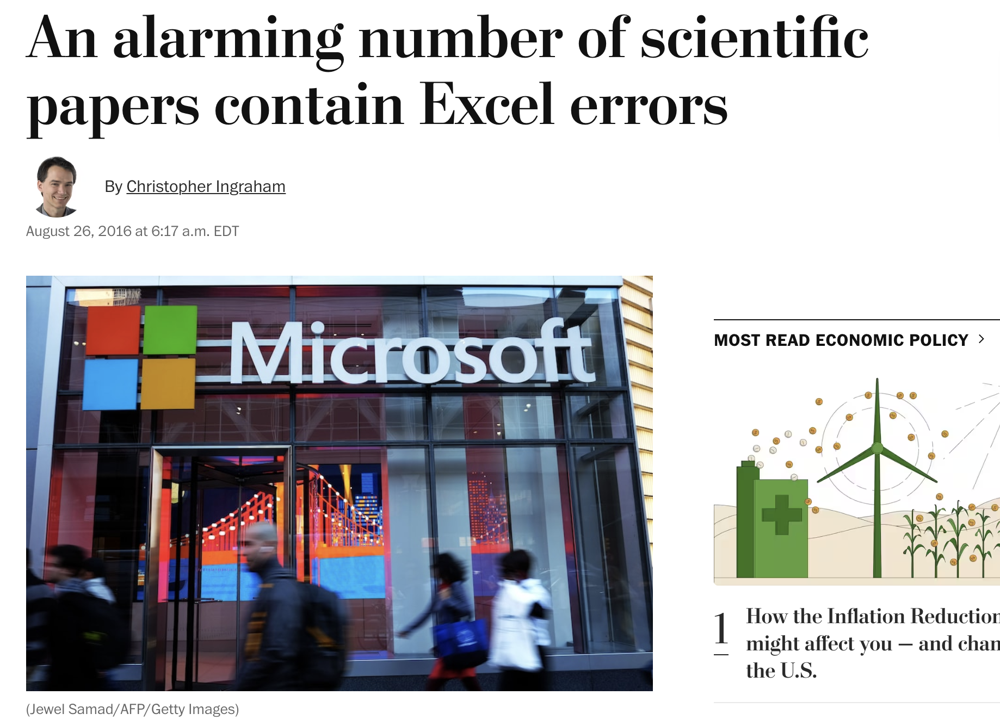
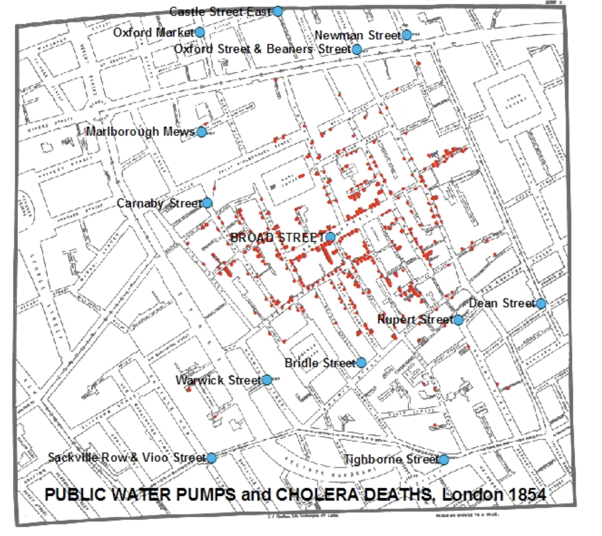
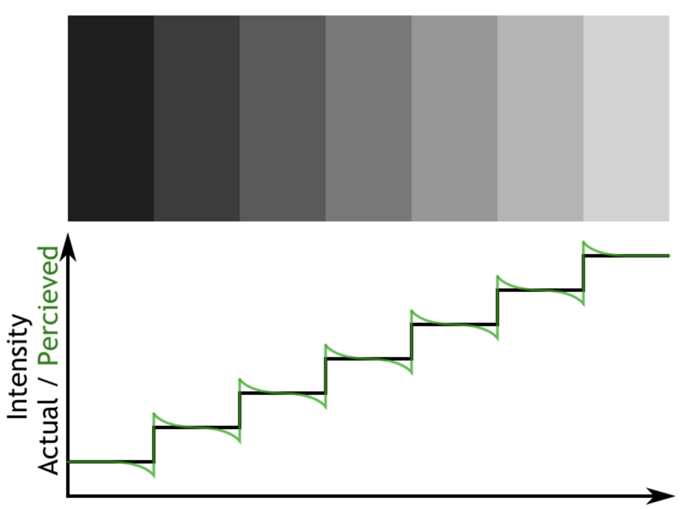
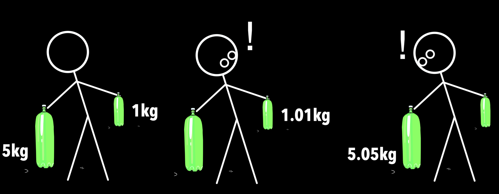
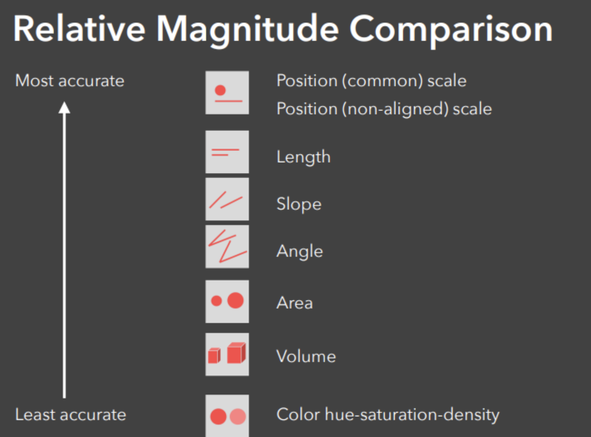
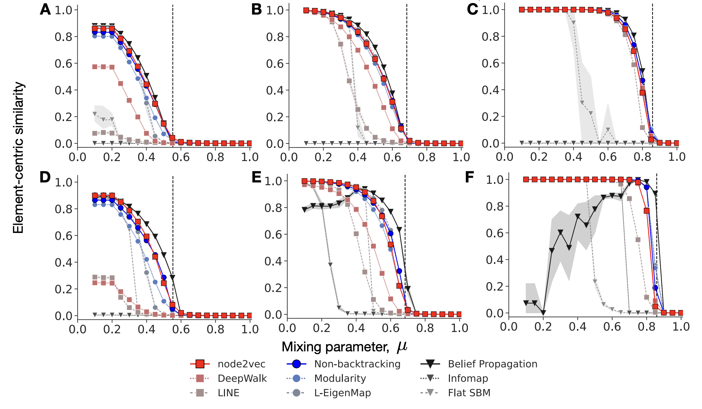
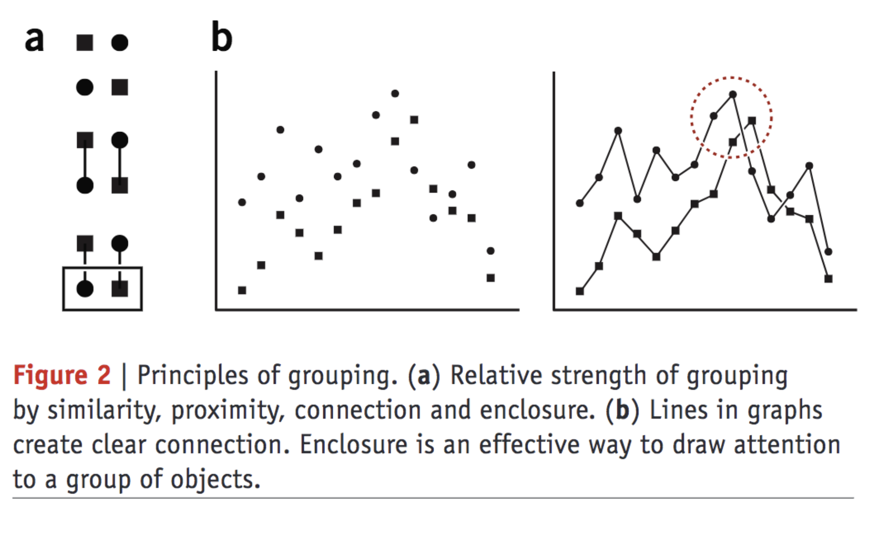

# Quiz


---


<div style="font-size:20pt;margin-top:-5%">

1. Why should we specify data types when loading data? Explain with an example.

2. We want to create a social network of students in a collage, in which each edge between two students indicates that they joined the same party, weighted by the number of parties they joined together. Let $B$ be a matrix, where $B_{ik}=1$ if student $i$ joins party $k$, and otherwise $B_{ij}=0$. Express the adjacency matrix $A$ of the student network by using B. Self-loops are allowed.

3. The weight of a self-loop edge indicates the number of parties a student joined alone. True or False.

3. If there is an edge with a large weight between two students, we can always say that the two students are friends to each other. True or False, and explain why.

</div>

---

[An alarming number of scientific papers contain Excel errors - The Washington Post](https://www.washingtonpost.com/news/wonk/wp/2016/08/26/an-alarming-number-of-scientific-papers-contain-excel-errors/?postshare=4161472211255740)




---

# <center class="vindent"> One-mode projection </center>

<center style="margin-top:55px"> Probably the most commonly used network construction method </center>

---

$$
(A)_{ij} = \sum_{y} B_{ik} B_{jk}
$$

or alternatively

$$
A = B B^\top
$$

---

### <center > Two types of measurements of edges </center>

- **Direct**:
  - e.g., ask people for their friends to identify friendship ties.
- **Indirect (inferential)**:
  - e.g., consider two people having a friendship tie if they hang out together frequently.
  - *Most networks are this type*.

One-mode projection generates edges based on correlation. And correlation does not imply causation.

---


### Advanced Topics in Network Science

SSIE 641

Module 4

Sadamori Kojaku

https://github.com/skojaku/adv-net-sci-course

---

### For EngiNet™ students


WARNING

All rights reserved.  No part of the course materials used in the instruction of this course may be reproduced in any form or by any electronic or mechanical means, including the use of information storage and retrieval systems, without written approval from the copyright owner.

©2023  Binghamton University state University of New York

---

# EngiNet Office Staff

- Janice Kinzer
  - Email:  enginet@binghamton.edu
  - Phone:  1-800-478-0718 or 607-777-4965
- Media Production Operator:
  - Sneha Rawat
- Instructor:
  - Sadamori Kojaku
  - skojaku@iu.edu
---

# Revisiting previous quiz

---

2. Create the Compressed Sparse Row Format of the undirected and unweighted network shown below with three arrays `indptr`, `indices` and `data`.

<center>


</center>

---

<div  style="font-size:22pt;margin-top:-5%">

Adjacency list
<center style="background-color:white">


</center>

```
{
  1: [2,5],
  2: [1,3,5],
  3: [2,4],
  4: [3,5,6],
  5: [1,2,4],
  6: [4],
}
```

CSR representation

```
indices = [2,5,1,3,5,2,4,3,5,6,1,2,4,4]
indptr = [0,2,5,7,10,13,14]
data = [1,1,1,1,1,1,1,1,1,1,1,1,1,1]
```

Neighbors of node $i$
```python
indices[indices[i]:indices[i+1]]
```

The weigh of edges to the neighbors of node $i$
```python
data[indices[i]:indices[i+1]]
```

</div>

---

<div  style="font-size:22pt;margin-top:-5%">

CSR representation

```
indices = [2,5,1,3,5,2,4,3,5,6,1,2,4,4]
indptr = [0,2,5,7,10,13,14]
data = [1,1,1,1,1,1,1,1,1,1,1,1,1,1]
```

The $k$th neighbor of node $i$
```python
i = 1
k = 2
indices[indices[i] + k]
```

The weight of the edge to the $k$th neighbor
```python
data[indices[i]+k]
```

</div>


---


# GigHub codespaces

### Please fork the course repo and open codespaces on your forked repo.

(otherwise I might go into bankruptcy 😭)

https://github.com/skojaku/adv-net-sci-course


---

# Assignment instruction

https://github.com/skojaku/adv-net-sci-course/wiki/Submitting-assignments

---

# <center class="vindent"> Data visualization </center>

<center style="margin-top:55px"> Probably the most important skill for anyone working with data </center>

---

# <center class="vindent"> Why data visualization? </center>

---

## <center class="vindent"> ... 1854, London </center>

---

<center>

# *Industorial revolution*

Rapid urbanization but no infrastructure

</center>


---

<center>

# *Nightman*

</center>


---

<center >

# *Night soil / Cesspools*

</center>


---


---

<center >

# *Cholera outbreak,* *1854*

127 died in three days.

</center>


---

# <center > "Miasma (bad air) theory" </center>
# <center > vs </center>
# <center > "Germ theory" </center>

---

<center >

# Henry Whitehead

</center>


---

<center>

# John Snow

</center>


---

<center>

# John Snow

</center>


---

<center >

# They changed the fate of human race.

### What did they do?

</center>

---


---



---

> *On proceeding to the spot, ***I found that nearly all the deaths had taken place within a short distance of the [Broad Street] pump***. There were only ten deaths in houses situated ***decidedly nearer*** to another street-pump. In five of these cases the families of the deceased persons informed me that they always sent to the pump in Broad Street, as they preferred the water to that of the pumps which were nearer. In three other cases, the deceased were children who went to school near the pump in Broad Street...*

*John Snow, letter to the editor of the Medical Times and Gazette*

---


---

# Can't we just use numbers?


---


---

<center>

## Anscombe's quartet

</center>


---

- [What data patterns can lie behind a correlation coefficient? (blog post)](https://figshare.com/articles/journal_contribution/What_data_patterns_can_lie_behind_a_correlation_coefficient_blog_post_/6945335/1)
- [Same Stats, Different Graphs - CHI 2017 - YouTube](https://www.youtube.com/watch?v=DbJyPELmhJc)

<iframe width="560" height="315" src="https://www.youtube.com/embed/DbJyPELmhJc?si=8Agx3YkY966z463F" title="YouTube video player" frameborder="0" allow="accelerometer; autoplay; clipboard-write; encrypted-media; gyroscope; picture-in-picture; web-share" allowfullscreen></iframe>

---

<center style="margin-top:30%">

# Our visual system is a powerful pattern recognition machine

</center>


---


<center >

# Networks

</center>

- nodes/edges,
- size/width
- colors
- layout
- ....


---


<center >

# Perception

### Why shuld we care?

</center>

---


---


---

<center >

# \#dressgate


</center>

:max_bytes(150000):strip_icc():focal(216x0:218x2)/internet-meltdown-435-1c7e5a912b5c41268776cbc309603516.jpg)

---

<blockquote class="twitter-tweet"><p lang="en" dir="ltr">I had to double check this using the Gimp. It is not a fake. Seeing is not believing. <a href="https://t.co/q8zHa4HIPH">pic.twitter.com/q8zHa4HIPH</a></p>&mdash; Kat Scott 🐀 (@kscottz) <a href="https://twitter.com/kscottz/status/873726218344050688?ref_src=twsrc%5Etfw">June 11, 2017</a></blockquote> <script async src="https://platform.twitter.com/widgets.js" charset="utf-8"></script>

---


---

# What is <span style="color:red">C</span><span style="color:yellow">o</span><span style="color:#0f0">l</span><span style="color:pink">o</span><span style="color:cyan">r</span>?

---

<div style="background-color:#ee0000;height:2350px;width:2350px;margin-left:-10%;margin-top:-5%;margin-bottom:-5%">
</div>

---

<div class="container">

<div class="col" style="flex:1;;margin-right:-5%;margin-left:-10%">
<center>
<div style="background-color:#ee0000;height:350px;width:350px">
<p style="padding-top:40%">Red</p>
</div>
</center>
</div>

<div class="col" style="flex:1;;margin-right:-5%;margin-left:-10">
<center>
<div style="background-color:#cc0000;height:350px;width:350px">
<p style="padding-top:40%">Red</p>
</div>
</center>
</div>

<div class="col" style="flex:1;;margin-right:-5%;margin-left:-10">
<center>
<div style="background-color:#aa0000;height:350px;width:350px">
<p style="padding-top:40%">Red</p>
</div>
</center>
</div>
</div>

---


---

# How can we quantitatively represent colors?

### Do you know any "system" to represent colors?

---

# RGB


---

# CMY(K)


---


---


---

### Brightness: HSL


### Brightness: HSV


---

# Lightness


---


---

# Which is lighter?

<div class="container">
<div class="col" style="flex:1;;margin-right:10%">
<center>
<div style="background-color:#adadad;height:350px;width:350px">
</div>
</center>
</div>
<div class="col" style="flex:1;;margin-right:10%">
<center>
<div style="background-color:#a8a8a8;height:350px;width:350px">
</div>
</center>
</div>
</div>

---

# Which is lighter?

<div class="container">
<div class="col" style="flex:1;;margin-right:-5%">
<center>
<div style="background-color:#adadad;height:350px;width:350px">
</div>
</center>
</div>
<div class="col" style="flex:1;">
<div style="background-color:#a8a8a8;height:350px;width:350px">
</div>
</center>
</div>
</div>

---




---


## Discussion

### <div style="margin-top:-5%">What is a problem of this map (from the perspective of human perception)?</div>

---

# <span style="color:red">H</span><span style="color:yellow">U</span><span style = "color:cyan">E</span>


---

## Three dimensions of colors


<div class="container">
<div class="col" style="flex:1">

### Brightness


</div>

<div class="col" style="flex:1">

### Lightness


</div>

<div class="col" style="flex:1">

### <span style="color:red">H</span><span style="color:yellow">U</span><span style = "color:cyan">E</span>


</div>
</div>

---

### What is the problem of the rainbow color?


---

[A Better Default Colormap for Matplotlib | SciPy 2015 | Nathaniel Smith and Stéfan van der Walt - YouTube](https://youtu.be/xAoljeRJ3lU?si=XPO_ZLBxt99eew5O)


<iframe width="560" height="315" src="https://www.youtube.com/embed/xAoljeRJ3lU?si=XPO_ZLBxt99eew5O" title="YouTube video player" frameborder="0" allow="accelerometer; autoplay; clipboard-write; encrypted-media; gyroscope; picture-in-picture; web-share" allowfullscreen></iframe>

---


---

# Green vs Red


---

<div style="font-size:150px"> 🙈 </div>


---

# Psychophysics

a branch of psychology on the relationships between phsyical stimulti and sensation

---



---

# Weber's law


<div style="font-size:100px">

$$
k = \frac{\Delta I}{I}
$$

</div>

- $I$: Intensity
- $\Delta I$: Changes in the intensity
- $k$: constant

(Just noticeable difference; JND)

---

# Steven's power law

---

### How many times is the larger one bigger than the smaller one (in terms of radius)?


<div class="container">
<div class="col" style="flex:1;margin-top:13%">


</div>
<div class="col" style="flex:1">


</div>
</div>

---

### How many times is the larger one bigger than the smaller one?


<div class="container">
<div class="col" style="flex:1;margin-top:13%;margin-right:-20%">

<center>
<div style="background-color:#f00;height:50px;width:200px;">
</div>
</center>

</div>
<div class="col" style="flex:1;margin-top:29%">

<center>
<div style="background-color:#f00;height:50px;width:600px">
</div>
</center>

</div>
</div>

---

## The larger ones are 3x bigger.

<div class="container">
<div class="col" style="flex:1;margin-top:13%">


</div>
<div class="col" style="flex:1">


</div>
</div>

<div class="container" style="margin-top:-20%">
<div class="col" style="flex:1;margin-top:13%;margin-right:-20%">

<center>
<div style="background-color:#f00;height:50px;width:200px;">
</div>
</center>

</div>
<div class="col" style="flex:1;margin-top:29%">

<center>
<div style="background-color:#f00;height:50px;width:600px">
</div>
</center>

</div>
</div>

---

# What did you find?

---

## Steven's power law

<div style="font-size:80px">

$$
S = I^\alpha
$$

</div>

- $S$: Sensation
- $I$: Intensity
- $\alpha$: Exponent


---



---

### What is the issue of pichart?


---

<blockquote class="twitter-tweet"><p lang="en" dir="ltr">Why you should not use pie charts. <a href="https://t.co/AahWfGYU6N">pic.twitter.com/AahWfGYU6N</a></p>&mdash; Max Roser (@MaxCRoser) <a href="https://twitter.com/MaxCRoser/status/857389434756505600?ref_src=twsrc%5Etfw">April 27, 2017</a></blockquote> <script async src="https://platform.twitter.com/widgets.js" charset="utf-8"></script>

---

<div style="margin-top:900px;margin-left:-8%;padding-left:0px;">

# From my paper


</div>

---

# <span style="color:f00">Pre-</span>attentative
# processing

---

# How many 5s?

# 345678904345678455678905643567890965

---

# How many 5s?

# 34<span style="color:red">5</span>67890434<span style="color:red">5</span>6784<span style="color:red">5</span><span style="color:red">5</span>67890<span style="color:red">5</span>643<span style="color:red">5</span>6789096<span style="color:red">5</span>

---


---


---


[The toll of Israeli bombs on Gaza, mapped - The Washington Post](https://www.washingtonpost.com/world/2021/06/11/gaza-damage-map-rebuilding-israel/)


---




---


---

# Gestalt Priniple

---

### How do we know the right order of panels to read without explicit instruction?


---


---


---



---

# Discussion


### How do you improve this visualization?


---

### Differentiate colors simultaneously along the three color dimensions


---

### Use predefined color maps

[ColorBrewer: Color Advice for Maps](https://colorbrewer2.org/#type=sequential&scheme=BuGn&n=3)

---

## Use different shapes


---

# References

[Checker shadow illusion - Wikipedia](https://en.wikipedia.org/wiki/Checker_shadow_illusion)
[Same Stats, Different Graphs - CHI 2017 - YouTube](https://www.youtube.com/embed/DbJyPELmhJc?si=8Agx3YkY966z463F)
[What data patterns can lie behind a correlation coefficient? (blog post)](https://figshare.com/articles/journal_contribution/What_data_patterns_can_lie_behind_a_correlation_coefficient_blog_post_/6945335/1)

[Color coding | Nature Methods](https://www.nature.com/articles/nmeth0810-573)
[A Better Default Colormap for Matplotlib | SciPy 2015 | Nathaniel Smith and Stéfan van der Walt - YouTube](https://youtu.be/xAoljeRJ3lU?si=XPO_ZLBxt99eew5O)

[The toll of Israeli bombs on Gaza, mapped - The Washington Post](https://www.washingtonpost.com/world/2021/06/11/gaza-damage-map-rebuilding-israel/)

[How Florence Nightingale Changed Data Visualization Forever - Scientific American](https://www.scientificamerican.com/article/how-florence-nightingale-changed-data-visualization-forever/)